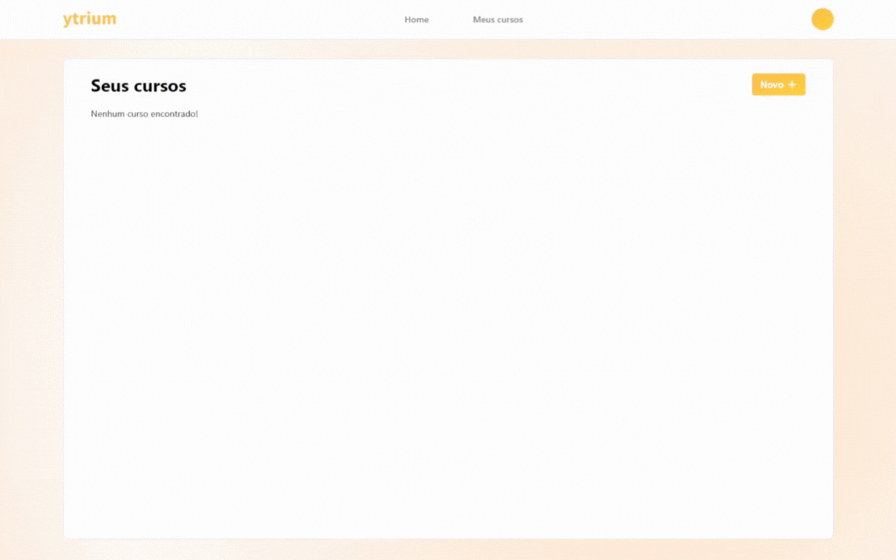
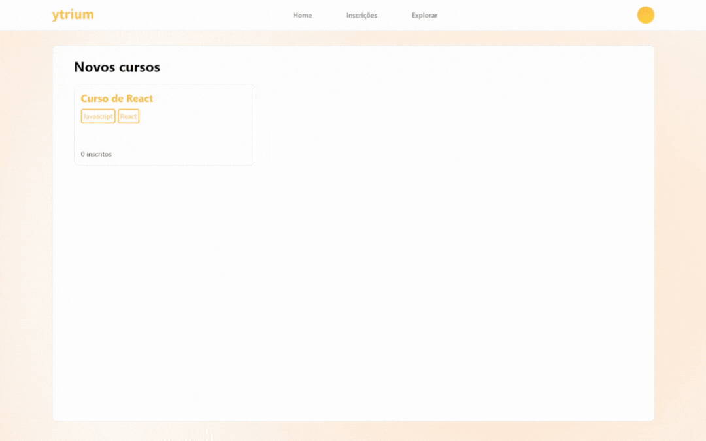

 

  

  <h3 align="center">TCC - ytrium</h3>

  

    Uma plataforma web de aprendizado!
     
  

  
Sumário

  <ol>
    <li>
      <a href="#sobre-o-projeto">Sobre o projeto</a>
      <ul>
        <li><a href="#feito-com">Feito com</a></li>
      </ul>
    </li>
    <li>
      <a href="#baixando-o-projeto">Baixando o projeto</a>
    </li>
    <li><a href="#demonstração">Demonstração</a></li>
    <li><a href="#contato">Contato</a></li>
  </ol>

## Sobre o projeto

  

 

Este projeto tem como intuito entregar uma plataforma web de aprendizado sobre tecnologia por meio de cursos, provendo uma forma de pessoas com interesse de ingressar na área de tecnologia, possam desenvolver suas habilidades.

Funcionalidades:
* Criação de cursos por parte dos usuários instrutores
* Inscrição nos cursos para alunos
* Processo de estudo dos conteúdos e de responder quizzes
* Download do certificado após completar o curso
* Cadastro de categorias por parte do administrador
* Aprovação dos cursos por parte do administrador

(<a href="#readme-top">voltar ao início</a>)

### Feito com

* [![React][React.js]][React-url]
* [![Express.js][Express.js]][Express-url]
* [![Mysql][Mysql]][Mysql-url]

(<a href="#readme-top">voltar ao início</a>)

### Baixando o projeto

Abaixo estão algumas orientações para baixar o projeto localmente.

- Requisitos:
  - Visual Studio Code
  - Mysql Workbench
  - Node.js

1. Baixe o projeto ou clone o repositório.

2. Abre o projeto usando o VS Code e, usando o terminal navegue até a pasta server e escreva o comando `npm install`, faça o mesmo na pasta client.

3. Utilize o arquivo *ytrium-database-script.sql* na raiz do projeto para criar o banco de dados no Mysql Workbench.
    - Obs.: Os usuários *admin@hotmail.com*, *ins@hotmail.com* e *pedro@hotmail.com* serão criados com a senha '123' para testes.

4. Agora no terminal na pasta server escreva o comando `npm start` e na pasta client o comando `npm run dev`.

5. Pronto, o sistema está funcionando, abra este link http://localhost:5173/ em um navegador.

(<a href="#readme-top">voltar ao início</a>)

## Demonstração

### Criação de cursos:

  

(<a href="#readme-top">voltar ao início</a>)

### Inscrição e realização dos cursos

  

## Contato

Email - pedroh_7@hotmail.com

Linkedin - https://www.linkedin.com/in/pedroalmeida714/

(<a href="#readme-top">voltar ao início</a>)

<!-- MARKDOWN LINKS & IMAGES -->
<!-- https://www.markdownguide.org/basic-syntax/#reference-style-links -->

[Express.js]: https://img.shields.io/badge/express-131417?style=for-the-badge&logo=express&logoColor=white
[Express-url]: https://expressjs.com/

[React.js]: https://img.shields.io/badge/React-20232A?style=for-the-badge&logo=react&logoColor=61DAFB
[React-url]: https://reactjs.org/

[Mysql]: https://img.shields.io/badge/Mysql-20232A?style=for-the-badge&logo=mysql&logoColor=white
[Mysql-url]: https://www.mysql.com/
